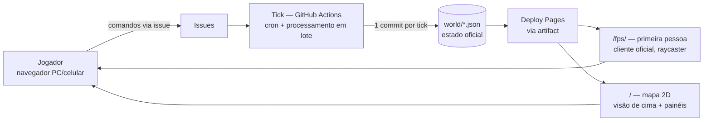

# Arquitetura — NÓS



## Pastas

```
engine/          motor do mundo (TypeScript, roda no tick)
  schema/        JSON Schema do estado — guardrail: estado inválido não entra
world/           estado oficial do universo (JSON pequeno, 1 commit por tick)
site/            cliente visual (TypeScript + canvas, publicado no Pages)
  scripts/       build-fps.mjs inline o mundo da batida em prototipos/fps/ -> /fps/
prototipos/fps/  cliente OFICIAL em primeira pessoa (raycaster, fonte da verdade)
prototipos/estudio/ estúdio de arte procedural (árvores/rochas/céu -> PNG)
assets/          sprites, tiles, paleta + CREDITS.md (previews 8x saem em assets/preview/, gitignorado)
.github/
  workflows/     tick.yml (cron) · ci.yml (testes+validação em PRs) · pages.yml (deploy)
  ISSUE_TEMPLATE/ formulários de comando (mover, coletar, dizer...)
docs/            visão, GDD, plano, continuidade, decisões, lore
.claude/agents/  agentes especializados (arte, código, lore, QA)
```

## Princípios técnicos

1. **TypeScript em tudo** — engine e cliente compartilham os mesmos tipos; impossível divergirem.
2. **1 tick = 1 commit** — custo constante por unidade de tempo, independente do nº de jogadores.
3. **Pages por artifact** (`actions/deploy-pages`) — o site publicado não entra no histórico git; repositório permanece leve para sempre. Reforço (D-30): binários regeneráveis (previews 8x, contact sheets, screenshots de QA) são artefatos de build gitignorados, nunca commitados na main.
3b. **Duas janelas, um só mundo** (D-29) — o cliente oficial é a primeira pessoa (`/fps/`, raycaster que lê o MESMO `world/heart.json`); o mapa 2D (`/`) é a visão de cima com os painéis (Mural/Comércio/Portais). `build-fps.mjs` inline o mundo da batida atual no HTML a cada deploy, então ambos acompanham o mundo vivo.
4. **Determinismo** — mesmo estado + mesmos comandos + mesma seed ⇒ mesmo resultado. Permite replay, auditoria e testes.
5. **Guardrails no CI** — todo PR roda: testes da engine, validação de schema do mundo, lint de sprites (dimensões/paleta). Merge bloqueado se falhar.
6. **Cliente burro, tick esperto** — o navegador só apresenta e monta comandos; toda regra de jogo vive na engine.

## Limites conhecidos (e mitigação)

- Latência de ação: 30s–60min conforme cadência do tick → design assíncrono assumido.
- Rate limit da API com muitos jogadores → comandos como comentários numa issue-thread única + N ações/tick por jogador.
- Actions em repo público: gratuito e ilimitado; jobs de tick devem terminar em minutos.
